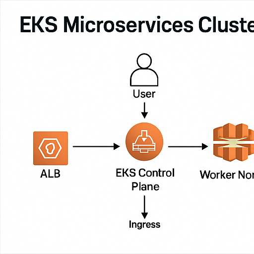

# EKS Microservices Cluster (Manual Build, Production-Style)

A production-minded Amazon EKS cluster with real microservices, ALB ingress, autoscaling, and persistence. This project is intentionally **manual** so you learn each piece by wiring it yourself.

---

## Architecture



**Flow**
1. Users hit **AWS ALB** (via AWS Load Balancer Controller Ingress).
2. ALB sends traffic to **Ingress** → **Service** → **Pods** on EKS worker nodes.
3. **ECR** hosts your images. **EKS** runs workloads on managed control plane.
4. **CloudWatch**, **Metrics Server**, and optional **Cluster Autoscaler** keep the cluster healthy.
5. **EBS CSI** backs persistent volumes for the database StatefulSet.

**Core AWS**: EKS, EC2 (managed node group), VPC, ECR, ALB, IAM, CloudWatch, EBS CSI.

---

## What’s Included

- **Declarative cluster spec** (eks/cluster-config.yaml) for `eksctl`
- **Kubernetes manifests** (Namespace, Deployments, Services, Ingress, HPA, DB StatefulSet, Secret)
- **Docker images** (simple backend API + static frontend) with Dockerfiles
- **Helper script** for teardown
- **AWS Perspective** instructions to export a diagram PNG for `docs/`

---

## Region & Names

Default region used here: **us-west-1**  
Cluster name: **eks-microservices**

> You can change region/name cluster-wide by editing the commands and `eks/cluster-config.yaml`.

---

## Quick Start (high-level)

1. **Create ECR repos** and push images (`docker/backend`, `docker/frontend`).
2. **Create EKS cluster** with `eksctl` (+ enable OIDC).
3. **Install**: EBS CSI add-on, Metrics Server, AWS Load Balancer Controller (ALB).
4. **Apply manifests**: Namespace → StorageClass → Secrets → Deployments/Services → Ingress → HPA.
5. **Get ALB DNS**: `kubectl get ingress -n app`
6. **Test** in browser with `http://<ALB-DNS>`.
7. **(Optional)** Install Cluster Autoscaler.
8. **Export diagram** with AWS Perspective.

---

## Clean Up

```bash
./scripts/cleanup.sh
eksctl delete cluster --name eks-microservices --region us-west-1

## License
MIT
