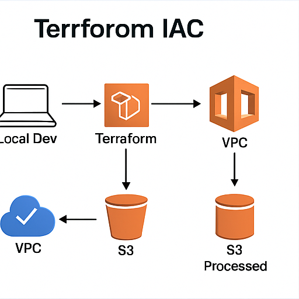

# Infrastructure as Code (IaC) with Terraform — AWS (Manual, Modular)

This project demonstrates **secure, repeatable AWS provisioning** using Terraform, built **piece‑by‑piece** so you deeply understand each moving part. It includes a remote backend (S3 + DynamoDB locks), a modular VPC + EC2, security groups, and optional VPC Flow Logs.

---

## Architecture

**Flow**

1. You write Terraform and commit to GitHub  
2. Terraform uses a **remote backend** (S3) with **DynamoDB locks**  
3. `terraform plan` previews changes; `terraform apply` provisions infrastructure  
4. AWS resources (VPC, subnets, IGW/NAT, route tables, EC2, SGs, S3) come online  

**Core Services**: VPC, Subnets, IGW/NAT, Route Tables, EC2, S3 (state), DynamoDB (state lock), IAM (minimal), CloudWatch (Flow Logs optional)

---

## What’s Included

- **Bootstrap stack** (`bootstrap/`) to create S3 bucket + DynamoDB lock table  
- **Remote state** configuration (`backend.tf`) wired to that bucket/table  
- **Modules**
  - `vpc`: VPC, public/private subnets (multi‑AZ), IGW, NAT GW, routes  
  - `ec2`: security group + single EC2 instance (Amazon Linux 2023) with user‑data  
- **Variables** with safe defaults; **`terraform.tfvars` example**  
- **AWS Perspective** steps to export the architecture PNG  

---

## Prerequisites

Before you begin, you should have:

- An **AWS account** with permissions for S3, DynamoDB, VPC, EC2, IAM, CloudWatch  
- **AWS CLI** installed and configured (e.g. `aws configure` set to `us-west-1` or your chosen region)  
- **Terraform** v1.5+ installed  
- Your **public IP address** (for `allowed_ssh_cidr`)  
- An **EC2 key pair** in the target region (for SSH access to the instance)  

---

## Quick Start

> Region default is **us-west-1**. Change with `var.region` if needed.

### 1) Get the project

git clone https://github.com/deanwbusch-prog/iac-terraform.git
cd iac-terraform

text

(Optional) Inspect the layout:

tree -L 2

text

Focus on: `bootstrap/`, `modules/vpc/`, `modules/ec2/`, `main.tf`, `backend.tf`, `terraform.tfvars.example`.

---

### 2) Bootstrap remote state (one‑time)

cd bootstrap
terraform init
terraform apply -auto-approve

text

Copy the `state_bucket` and `lock_table` outputs. You will paste these into `backend.tf` at the repo root.

---

### 3) Configure backend

From the repo root:

- Open `backend.tf` and replace the placeholders with your bootstrap outputs:
  - `bucket = "REPLACE_WITH_BOOTSTRAP_BUCKET"` → your `state_bucket`  
  - `dynamodb_table = "REPLACE_WITH_BOOTSTRAP_LOCK_TABLE"` → your `lock_table`  

Then:

cd ..
terraform init -migrate-state

text

This switches Terraform to the S3/DynamoDB backend.

---

### 4) Set project variables

Create your variables file:

cp terraform.tfvars.example terraform.tfvars

text

Edit `terraform.tfvars` and at minimum set:

- `project  = "iac-terraform"` (or another name)  
- `region   = "us-west-1"`  
- `allowed_ssh_cidr = "YOUR.IP.ADDR.0/32"` (e.g. `203.0.113.7/32`)  
- `key_name = "<your-ec2-keypair-name>"`  
- `instance_type = "t3.micro"`  

You can leave CIDRs and flow logs defaults as‑is for the first run.

---

### 5) Apply in two stages

#### 5a. Create only the VPC

(Optional plan):

terraform plan -target=module.vpc

text

Apply the VPC:

terraform apply -target=module.vpc

text

This creates the VPC, 2 public + 2 private subnets, IGW, NAT, and route tables.

#### 5b. Add EC2

Apply the full stack:

terraform apply

text

This adds the security group + EC2 instance + Nginx web server and outputs `ec2_public_ip`.

---

### 6) Verify the environment

In the AWS Console:

- **VPC** → confirm new VPC, subnets, route tables, NAT/IGW  
- **EC2** → instance is running and has a public IP  

From your machine:

SSH:

ssh -i /path/to/your-key.pem ec2-user@<ec2_public_ip>

text

Browser:

http://<ec2_public_ip>

text

You should see the Nginx page created by user data.

---

## Security

- **Remote state**: versioned, encrypted S3 + DynamoDB locking  
- **Security groups**: SSH restricted to `allowed_ssh_cidr` (your IP)  
- **No hardcoded AMIs**: Amazon Linux 2023 resolved dynamically  
- **Workspaces**: recommended for dev/test/prod separation  

---

## AWS Perspective (Diagram)

1. Open **AWS Perspective** from the AWS Solutions Library in the console.  
2. Add your account and region as a data source and run a scan.  
3. Build a diagram showing VPC, public/private subnets, IGW, NAT, EC2.  
4. Export it as PNG and save into:

docs/Infrastructure-as-Code_Architecture.png

text

Commit this file to your repo.

---

## Future Enhancements

- GitHub Actions CI (fmt/validate/plan)  
- Private ALB + Auto Scaling Groups  
- SSM Session Manager (no SSH)  
- Multi‑region DR patterns  

---

## Cleanup

Destroy main stack (from repo root):

terraform destroy

text

Destroy backend last:

cd bootstrap
terraform destroy
cd ..

text

This removes the S3 bucket and DynamoDB table after the rest of the resources are gone.

---

## License

MIT
