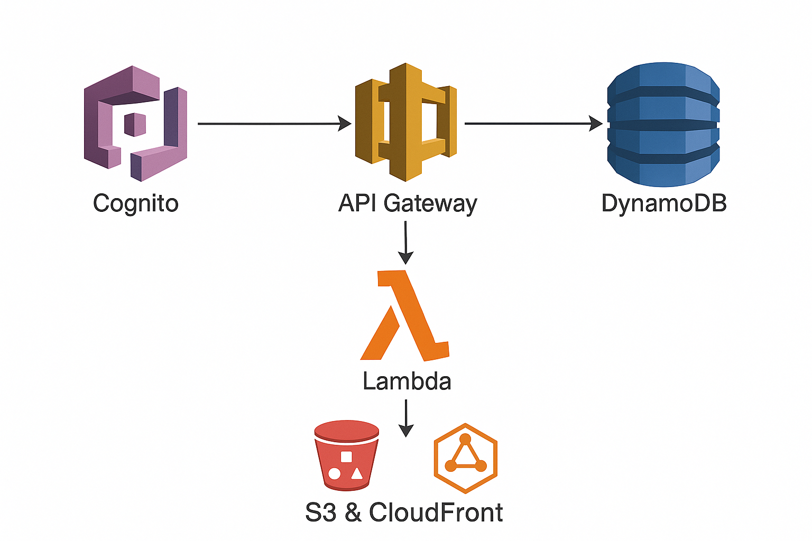

# Serverless To-Do App

## Overview
This project is a fully serverless web application built on AWS that allows users to securely manage their tasks with full CRUD (Create, Read, Update, Delete) functionality.  

The architecture is designed for **scalability**, **low operational cost**, and **ease of management** by using AWS managed services.  
This app demonstrates cloud-native development skills in serverless design and is ideal for showcasing modern AWS best practices.

---

## Architecture


**Workflow:**
1. **User Authentication**  
   AWS Cognito handles user registration, login, and secure authentication.
2. **API Routing**  
   API Gateway acts as the front door for all HTTP requests.
3. **Business Logic**  
   AWS Lambda executes the backend functions for CRUD operations.
4. **Data Storage**  
   Amazon DynamoDB stores tasks in a highly scalable, NoSQL database.
5. **Frontend Hosting**  
   A static web app hosted on Amazon S3 and distributed globally via Amazon CloudFront.

---

## AWS Services Used
- **Amazon Cognito** – Secure user sign-up and sign-in.
- **Amazon API Gateway** – REST API endpoint for client communication.
- **AWS Lambda** – Serverless compute for backend logic.
- **Amazon DynamoDB** – NoSQL database for task storage.
- **Amazon S3** – Static hosting for frontend files.
- **Amazon CloudFront** – Global content delivery network (CDN).
- **AWS IAM** – Secure role-based permissions for services.

---

## Features
- User registration and login with JWT-based authentication.
- CRUD operations on tasks (create, view, update, delete).
- Fully serverless, pay-as-you-go infrastructure.
- Scales automatically with no manual server management.
- Global delivery for low-latency user experience.

---

## Folder Structure
serverless-todo-app/
│
├── backend/
│ ├── functions/ # Lambda functions
│ ├── templates/ # AWS SAM templates
│ └── requirements.txt
│
├── frontend/
│ ├── index.html
│ ├── css/
│ └── js/
│
├── docs/
│ └── architecture.png # Architecture diagram
│
└── README.md

--

## Deployment Instructions

### **1. Clone the Repository**
```bash
git clone https://github.com/deanwbusch-prog/serverless-todo-app.git
cd serverless-todo-app
2. Configure AWS CLI
Ensure your AWS CLI is configured for the us-west-1 region:
aws configure
AWS Access Key ID: Your AWS Key
AWS Secret Access Key: Your AWS Secret
Default region name: us-west-1

3. Deploy Backend Using AWS SAM
cd backend
sam build
sam deploy --guided
During the guided deploy:
Stack Name: serverless-todo-app
Region: us-west-1
Confirm defaults and deploy.
Once complete, you’ll get:
API Gateway endpoint URL
Lambda ARNs
DynamoDB table name

4. Deploy Frontend to S3
aws s3 mb s3://serverless-todo-app-frontend-us-west-1
aws s3 sync ./frontend s3://serverless-todo-app-frontend-us-west-1
5. Set Up CloudFront Distribution
Go to the AWS Console → CloudFront.
Create a new distribution.
Select your S3 bucket as the origin.
Save the CloudFront domain name (e.g., https://d1234abcd.cloudfront.net).

Usage
Access the frontend via the CloudFront domain.
Register as a new user through Cognito.
Create, view, update, and delete tasks directly from the app.

Security Considerations
Cognito provides secure authentication with JWT tokens.
IAM roles are configured with least privilege access.
API Gateway endpoints are protected by Cognito authentication.
DynamoDB streams and Lambda permissions are scoped tightly to reduce risk.

Future Enhancements
Add email notifications for tasks using Amazon SNS.
Implement tagging and task priority levels.
Integrate with AWS CodePipeline for CI/CD automation.
Add CloudWatch metrics and alarms for monitoring.

License
This project is licensed under the MIT License.
